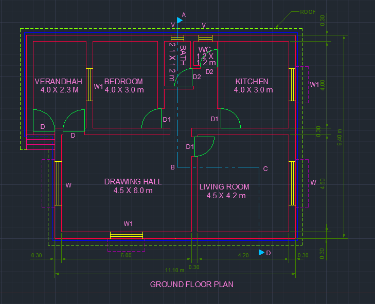

# 🏗️ Professional CAD Dimensioning System

**A comprehensive toolkit for creating precise, standardized engineering drawings**

## 📖 Project Overview
I developed this CAD dimensioning system to streamline the creation of professional engineering and architectural drawings. This project implements industry-standard practices with enhanced automation and consistency tools for civil engineering applications.

## 🎯 Project Purpose
This system solves common drafting challenges by providing:
- **Standardized workflows** for consistent drawing quality
- **Time-saving automation** for repetitive tasks
- **Pre-configured templates** for different project types
- **Error-prevention tools** to maintain drawing accuracy

## 🛠️ Key Features

### 🏗️ **For Civil Engineering Projects**
- Site plan templates with proper scaling
- Structural drawing presets
- Foundation and elevation dimension styles
- Earthwork and grading annotation tools

### ⚡ **Automation Tools**
- One-click layer and style setup
- Batch processing for multiple drawings
- Automatic unit management
- Smart dimension placement algorithms

### 📐 **Standards Compliance**
- Pre-configured styles for different scales (1:50, 1:100, 1:200)
- Layer naming conventions following industry standards
- Annotation systems for architectural and engineering needs
- Export-ready formatting for professional deliverables

## 📊 Professional Benefits
- Unified drawing standards across team members
- Easy onboarding for new team members
- Reliable quality control
- Efficient review processes

## 🌍 Real-World Applications
This system has been designed with practical engineering needs in mind:

**Site Development Plans:** Complete dimensioning for land development  
**Structural Drawings:** Precise framing and foundation documentation  
**Infrastructure Projects:** Road, utility, and grading plans  
**Archural Documentation:** Building plans and elevation drawings

---
*Built with practical engineering workflows in mind • Ready for production use*
